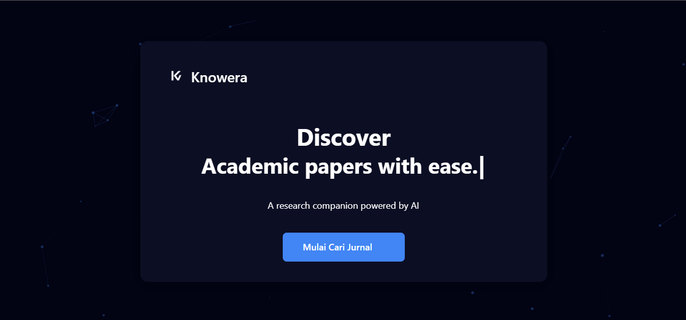

# Knowvera - AI-Powered Academic Paper Search Engine

Knowvera is an AI-powered academic paper search system with advanced features including semantic search, automatic summarization, and interactive chat with papers.

## 📸 Application Preview

### 🎯 **Main Features Overview**

<div align="center">

| Feature | Screenshot | Description |
|---------|------------|-------------|
| **🏠 Homepage** |  | Clean landing page with AI-powered search |
| **🔍 Search Page** |  | Advanced filtering and intelligent result |

</div>

---

## ⚠️ Development Status

**This project is still in active development.** Some features may not be optimal yet:

### ✅ **Working Features:**
- AI-powered paper search
- User authentication (Google OAuth)
- Personal paper collection system
- Interactive chat with papers
- Automatic citation generation
- PDF upload and analysis
- Responsive dark theme UI
- Guest mode access

### ⚠️ **Features Needing Improvement:**
- **Search results from Semantic Scholar and Google Scholar sometimes limited** (due to rate limiting)
- AI response speed optimization needed
- Domain filtering accuracy improvements
- External API connection stability
- Search result relevance scoring
- Error handling for API failures

### 🚧 **Known Limitations:**
- **Rate Limiting Issues:** API providers impose strict limits affecting search performance
- **Inconsistent Results:** Search engines may return empty results during peak usage
- **AI Model Availability:** Gemini API quotas may affect chat functionality
- **Performance:** Response times can vary based on API load

## 🚀 Key Features

### 1. **AI-Powered Search**
- Semantic search using Google Gemini
- Multi-language support (Indonesian & English)
- Domain and year filtering
- AI-generated search suggestions
- Intelligent query analysis

### 2. **Paper Management**
- Personal paper collections
- Notes and annotations
- Research activity tracking
- Multiple citation format export (APA, MLA, Chicago, IEEE)
- Paper favorites and bookmarking

### 3. **Interactive Chat**
- Chat with papers using AI
- PDF upload for comprehensive analysis
- Persistent chat sessions
- Context-aware responses
- Question answering about paper content

### 4. **User Experience**
- Modern dark theme design
- Responsive layout for all devices
- Google OAuth integration
- Guest mode for limited access
- Intuitive navigation

## 🛠️ Technology Stack

### Backend
- **FastAPI** - Modern Python web framework
- **MySQL** - Primary database
- **Google Gemini AI** - Natural language processing
- **OAuth 2.0** - Secure authentication
- **Uvicorn** - ASGI server

### Frontend
- **HTML5/CSS3/JavaScript** - Core web technologies
- **Bootstrap 5** - UI framework
- **Font Awesome** - Icons
- **SweetAlert2** - Modern alerts
- **Chart.js** - Data visualization

### AI & Machine Learning
- **Google Generative AI** - Text generation and analysis
- **Sentence Transformers** - Semantic embeddings
- **ArXiv API** - Academic paper data
- **Semantic Scholar API** - Research paper metadata
- **OpenRouter API** - Alternative AI models

### Data Sources
- **ArXiv** - Preprint repository
- **Semantic Scholar** - Academic search engine
- **Google Scholar** - Academic web search
- **Direct PDF upload** - User content

## 📋 Prerequisites

Before installing Knowvera, ensure you have:

- **Python 3.8+**
- **MySQL 8.0+**
- **Google Cloud account** (for Gemini API)
- **Gmail account** (for OAuth and email)
- **Git** (for cloning repository)

## 🔧 Installation & Setup

### 1. Clone Repository
```bash
git clone https://github.com/your-username/knowvera.git
cd knowvera
```

### 2. Create Python Virtual Environment
```bash
# Create virtual environment
python -m venv venv

# Activate virtual environment
# Windows:
venv\Scripts\activate
# Linux/Mac:
source venv/bin/activate

# Upgrade pip
python -m pip install --upgrade pip
```

### 3. Install Dependencies
```bash
# Install required packages
pip install -r requirements.txt
```

### 4. Database Setup
```bash
# Create MySQL database
mysql -u root -p
```
```sql
CREATE DATABASE knowvera;
CREATE USER 'knowvera_user'@'localhost' IDENTIFIED BY 'your_password';
GRANT ALL PRIVILEGES ON knowvera.* TO 'knowvera_user'@'localhost';
FLUSH PRIVILEGES;
EXIT;
```

### 5. Environment Configuration
```bash
# Copy environment template
cp .env.example .env

# Edit .env file with your configuration
nano .env  # or use your preferred editor
```

### 6. Required API Keys Setup

#### 🔑 Google Gemini API (Required)
1. Visit [Google AI Studio](https://makersuite.google.com/)
2. Create a new project or select existing
3. Generate API key
4. Add to `.env` as `GOOGLE_API_KEY=your_api_key`

#### 🔑 Google OAuth (Optional - for user login)
1. Go to [Google Cloud Console](https://console.cloud.google.com/)
2. Create new project or select existing
3. Enable Google+ API and Gmail API
4. Create OAuth 2.0 credentials
5. Add authorized redirect URIs: `http://localhost:8000/api/auth/google/callback`
6. Add Client ID and Secret to `.env`:
   ```
   GOOGLE_CLIENT_ID=your_client_id
   GOOGLE_CLIENT_SECRET=your_client_secret
   ```

#### 📧 Email Configuration (Optional - for notifications)
1. Enable 2-factor authentication in Gmail
2. Generate App Password in Google Account settings
3. Add to `.env`:
   ```
   EMAIL_USERNAME=your_email@gmail.com
   EMAIL_PASSWORD=your_app_password
   ```

### 7. Generate Secret Key

Before configuring environment variables, generate a secure secret key:

```bash
# Method 1: Using Python (recommended)
python -c "import secrets; print('SECRET_KEY=' + secrets.token_hex(32))"

# Method 2: Using the provided script
python generate_secret_key.py

# Method 3: Manual generation (if needed)
python -c "import os; print('SECRET_KEY=' + os.urandom(32).hex())"
```

Copy the generated secret key to your `.env` file.

### 8. Environment Variables Configuration

Edit your `.env` file with the following configuration:

```env
# Database Configuration
DB_USER=knowvera_user
DB_PASSWORD=your_database_password
DB_HOST=localhost
DB_PORT=3306
DB_NAME=knowvera

# Security (use the generated secret key from step 7)
SECRET_KEY=your-generated-secret-key-from-step-7
ALGORITHM=HS256
ACCESS_TOKEN_EXPIRE_MINUTES=1440

# Google Services
GOOGLE_CLIENT_ID=your-google-client-id
GOOGLE_CLIENT_SECRET=your-google-client-secret
GOOGLE_REDIRECT_URI=http://localhost:8000/api/auth/google/callback
GOOGLE_API_KEY=your-gemini-api-key

# Email Configuration (Optional)
EMAIL_HOST=smtp.gmail.com
EMAIL_PORT=587
EMAIL_USERNAME=your-email@gmail.com
EMAIL_PASSWORD=your-app-password
EMAIL_FROM=Knowvera <your-email@gmail.com>
EMAIL_TLS=True

# Application Settings
DEBUG=True
APP_ENV=development

# Optional: OpenRouter API (for alternative AI models)
OPENROUTER_API_KEY=your-openrouter-api-key
```

⚠️ **Important:** Never use the default secret key in production. Always generate a new one.

### 9. Initialize Database
```bash
# Run database initialization (if migration script exists)
python init_db.py

# Or manually create tables using MySQL client
mysql -u knowvera_user -p knowvera < database/schema.sql
```

### 10. Run Application
```bash
# Method 1: Using the main entry point
python main.py

# Method 2: Using the run script (if available)
python run.py

# Method 3: Using uvicorn directly
uvicorn main:app --reload --host 0.0.0.0 --port 8000

# Production mode
uvicorn main:app --host 0.0.0.0 --port 8000
```

### 11. Access Application
Open your browser and navigate to:
- **Main Application:** `http://localhost:8000`
- **API Documentation:** `http://localhost:8000/docs`
- **Alternative API Docs:** `http://localhost:8000/redoc`

## 📁 Project Structure

```
knowvera/
├── app/
│   ├── ai/                    # AI services (Gemini, search, etc.)
│   │   ├── gemini_service.py  # Google Gemini integration
│   │   ├── search_service.py  # AI-powered search logic
│   │   └── chat_service.py    # Interactive chat system
│   ├── auth/                  # Authentication & authorization
│   │   ├── oauth.py           # Google OAuth implementation
│   │   └── jwt_handler.py     # JWT token management
│   ├── config/                # Configuration files
│   │   ├── database.py        # Database configuration
│   │   └── ai_config.py       # AI model configuration
│   ├── database/              # Database models & connections
│   │   ├── models.py          # Database models
│   │   └── connection.py      # Database connection
│   ├── routes/                # API endpoints
│   │   ├── search.py          # Search endpoints
│   │   ├── auth.py            # Authentication endpoints
│   │   ├── collections.py     # Paper collection endpoints
│   │   └── chat.py            # Chat endpoints
│   ├── scrapers/              # Web scraping utilities
│   │   └── paper_scraper.py   # Academic paper scrapers
│   └── services/              # Business logic services
│       ├── user_service.py    # User management
│       ├── paper_service.py   # Paper management
│       └── citation_service.py # Citation generation
├── assets/
│   ├── css/                   # Stylesheets
│   │   ├── main.css          # Main styles
│   │   └── dark-theme.css    # Dark theme
│   ├── js/                    # JavaScript files
│   │   ├── main.js           # Core functionality
│   │   ├── search.js         # Search interface
│   │   └── chat.js           # Chat interface
│   └── images/                # Static images
├── views/                     # HTML templates
│   ├── index.html            # Home page
│   ├── search.html           # Search interface
│   ├── chat.html             # Chat interface
│   └── collections.html      # User collections
├── uploads/                   # User uploaded files
├── logs/                      # Application logs
├── .env.example              # Environment template
├── .gitignore                # Git ignore rules
├── requirements.txt          # Python dependencies
├── main.py                   # Application entry point
└── README.md                 # This file
```

## 🔐 Security Configuration

### Generate Secret Key
```bash
# Generate a secure secret key
python -c "import secrets; print(secrets.token_hex(32))"
```

### Database Security
- Use strong passwords for database users
- Limit database user privileges
- Enable SSL connections for production

### API Security
- Keep API keys secure and never commit them
- Use environment variables for all sensitive data
- Implement rate limiting for production

## 🚧 Known Issues & Current Limitations

### **Primary Issues:**

#### 1. **API Rate Limiting**
- **Semantic Scholar API:** 100 requests per 5 minutes
- **Google Scholar:** May block requests with CAPTCHA
- **Google Gemini:** 60 requests per minute (free tier)
- **Impact:** Search results may be empty or limited during peak usage

#### 2. **Search Result Quality**
- Some searches return no results due to API limitations
- Domain filtering accuracy needs improvement
- Relevance scoring could be enhanced
- Language detection sometimes inconsistent

#### 3. **Performance Issues**
- AI response times vary based on model availability
- Large PDF processing can be slow
- Concurrent user support is limited

### **Workarounds Implemented:**
- ✅ Automatic fallback between different APIs
- ✅ Request caching to reduce API calls
- ✅ Retry logic with exponential backoff
- ✅ Multiple AI model support for fallbacks
- ✅ Guest mode for users without authentication

### **Future Improvements Planned:**
- [ ] Implement more robust database caching
- [ ] Add alternative API sources for paper data
- [ ] Optimize AI model selection algorithm
- [ ] Enhanced error handling and user feedback
- [ ] Performance monitoring and analytics
- [ ] Comprehensive unit and integration tests
- [ ] User feedback system for search quality
- [ ] Advanced search filters and sorting options

## 🧪 Testing

### Run Basic Tests
```bash
# Test database connection
python -c "from app.database.connection import test_connection; test_connection()"

# Test API endpoints
curl http://localhost:8000/health

# Test search functionality
curl -X POST http://localhost:8000/api/search -H "Content-Type: application/json" -d '{"query":"artificial intelligence"}'
```

### Manual Testing Checklist
- [ ] User registration and login
- [ ] Paper search with various queries
- [ ] PDF upload and chat functionality
- [ ] Collection management
- [ ] Citation generation
- [ ] Responsive design on different devices

## 🤝 Contributing

This project is actively seeking contributors! Here's how you can help:

### **High Priority Areas:**
1. **API Integration:** Improve search result consistency
2. **Performance:** Optimize response times
3. **UI/UX:** Enhance user experience
4. **Testing:** Add comprehensive test coverage
5. **Documentation:** Improve setup guides

### **Development Guidelines:**
1. Fork the repository
2. Create a feature branch (`git checkout -b feature/AmazingFeature`)
3. Make your changes with clear commit messages
4. Add tests for new functionality
5. Update documentation as needed
6. Submit a Pull Request with detailed description

### **Bug Reports:**
When reporting bugs, please include:
- Detailed description of the issue
- Steps to reproduce the problem
- Expected vs actual behavior
- Screenshots or error logs
- Environment details (OS, Python version, etc.)
- Browser and version (for frontend issues)

### **Feature Requests:**
- Check existing issues before creating new ones
- Provide clear use cases and requirements
- Consider the impact on existing functionality

## 📊 Performance Considerations

### **System Requirements:**
- **Minimum:** 2GB RAM, 1 CPU core
- **Recommended:** 4GB RAM, 2 CPU cores
- **Storage:** 5GB free space (for logs, uploads, cache)

### **Scaling Considerations:**
- Database connection pooling needed for production
- Consider Redis for session storage and caching
- Load balancing for multiple instances
- CDN for static assets

## 📄 License

This project is licensed under the MIT License - see the [LICENSE](LICENSE) file for details.

### **MIT License Summary:**
- ✅ Commercial use allowed
- ✅ Modification allowed
- ✅ Distribution allowed
- ✅ Private use allowed
- ❗ No warranty provided
- ❗ License and copyright notice required

## 👨‍💻 Author & Contact

**Project Author:** [Nandana Aka Daarns]
- **GitHub:** [@Daarns](https://github.com/Daarns)
- **Email:** nandana219@gmail.com
- **LinkedIn:** [M Nandana Aruna Apta Baswara](https://linkedin.com/in/m-nandana-aruna-apta-baswara-a21291289)

## 🙏 Acknowledgments

### **APIs & Services:**
- [Google Gemini AI](https://ai.google.dev/) - Natural language processing
- [ArXiv](https://arxiv.org/) - Academic paper repository
- [Semantic Scholar](https://www.semanticscholar.org/) - Research paper metadata
- [Google Scholar](https://scholar.google.com/) - Academic search engine

### **Open Source Libraries:**
- [FastAPI](https://fastapi.tiangolo.com/) - Modern Python web framework
- [Bootstrap](https://getbootstrap.com/) - Frontend UI framework
- [Sentence Transformers](https://www.sbert.net/) - Semantic embeddings
- [Beautiful Soup](https://www.crummy.com/software/BeautifulSoup/) - Web scraping

### **Development Tools:**
- [Visual Studio Code](https://code.visualstudio.com/) - Code editor
- [MySQL](https://www.mysql.com/) - Database system
- [Git](https://git-scm.com/) - Version control

## ⚠️ Important Disclaimers

### **Academic Use:**
This project is created for educational and research purposes. Please ensure compliance with:
- Terms of service of all APIs used
- Copyright laws for academic content
- Institutional policies for research tools
- Fair use guidelines for academic papers

### **Data Privacy:**
- User data is stored locally in your MySQL database
- PDF uploads are processed locally and not shared
- API calls to external services follow their respective privacy policies
- No user data is sold or shared with third parties

### **Rate Limiting Notice:**
- Free tier APIs have usage limitations
- Production deployment may require paid API subscriptions
- Monitor your API usage to avoid service interruptions

---

**🚀 Ready to get started?** Follow the installation guide above and join our community of academic researchers using AI to enhance their research workflow!

**📝 Found an issue?** Please report it in our [GitHub Issues](https://github.com/your-username/knowvera/issues) page.

**💡 Have a feature idea?** We'd love to hear it! Create a feature request in our repository.
